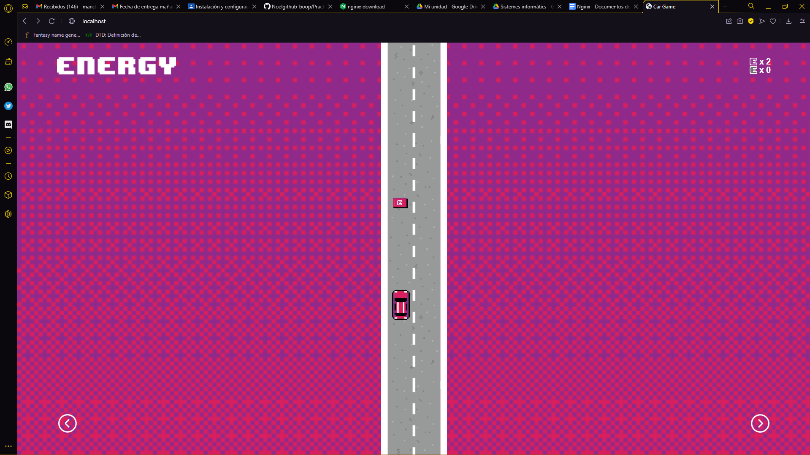

Iniciamos el proyecto descargando nginx de la siguiente página

Extraemos el archivo .RARY ya lo tendríamos descargado.

Una vez descargado, le das a ejecutar (si el firewall salta con un mensaje le das a permitir)

Y se ejecuta en en segundo plano

Para acceder a él, debemos ir aquí

Y activamos la anterior configuración. (Debería salir esta pestañita al finalizar)

Siguientemente se debe crear un acceso directo en el que guardarás el proyecto HTML. En mi caso es (C:\\Users\\manel\\OneDrive\\Escritorio\\Fp curso\\NGINX TE ODIO)

Especificas la localización de donde guardarás el html, cierras nginx desde administrador de tareas y lo abres nuevamente.

Y voilà magia.

Y aquí el segundo
